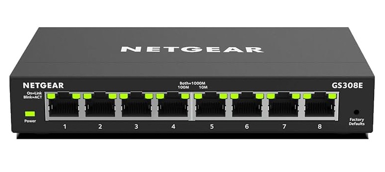
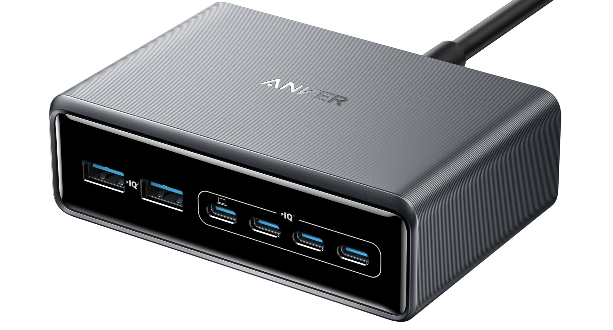

# Hardware Overview

I am currently in the process of building the cluster from the ground up. I wiped all previous configurations and decided to start fresh while writing this documentation. The goal is to create a clean and well-documented setup that I can build on as the project continues.

Most of the parts I am using came from my local Micro Center. I started without any intention of using a rack or enclosure, but as the number of nodes increased and I began reorganizing everything, I realized it would help to have a proper way to hold and manage them. For now, I am using the Pi Cluster Case that I picked up from Micro Center. It works well enough, but I plan to design and 3D print a custom enclosure later that can better suit the layout I want.

---

## Raspberry Pi Boards

- **1× Raspberry Pi 4 (4GB RAM)**  
  Used as the dedicated load balancer. It handles all traffic to the control-plane nodes.

- **3× Raspberry Pi 5 (8GB RAM)**  
  These are the control-plane nodes. Each is connected to an NVMe SSD using an M.2 HAT for faster and more reliable storage.

- **2× Raspberry Pi 5 (8GB RAM)**  
  These serve as worker nodes. They are used for running workloads and can be scaled further later on.

I still have a few other Raspberry Pi 4 boards, but they are not part of the current setup.

---

## Storage

When I first started building the cluster, I planned to run everything using SD cards. I picked up several cards of different sizes to match the roles of each node. But as I began setting up the control-plane nodes, I realized it made more sense to switch them to faster and more reliable storage. I decided to use NVMe SSDs for the master nodes to avoid performance bottlenecks and reduce the risk of corruption during updates or heavy workloads.

Below is the current storage setup:

### Load Balancer

| Load Balancer     | Storage Type         | Storage Size |
|-------------------|----------------------|--------------|
| Raspberry Pi 4    | SD Card (V30 A1)     | 128 GB       |

### Control Plane Nodes

| Node                       | Storage Type                     | Storage Size |
|----------------------------|----------------------------------|--------------|
| Raspberry Pi 5 #1 (Master) | NVMe SSD (SK Hynix 2242 PCIe)    | 256 GB       |
| Raspberry Pi 5 #2 (Master) | NVMe SSD (SK Hynix 2242 PCIe)    | 256 GB       |
| Raspberry Pi 5 #3 (Master) | NVMe SSD (SK Hynix 2242 PCIe)    | 256 GB       |

The SSDs are connected using M.2 NVMe HATs.

### Worker Nodes

| Node                       | Storage Type      | Storage Size |
|----------------------------|-------------------|--------------|
| Raspberry Pi 5 #4 (Worker) | SD Card (XC1)     | 64 GB        |
| Raspberry Pi 5 #5 (Worker) | SD Card (XC1)     | 64 GB        |

### Storage Summary

- **Load Balancer (RPi 4)**:
    - 128GB SD Card (V30 A1)
- **Control Plane (3x RPi 5)**:
    - 3 x 256GB SK Hynix PCIe NVMe 2242 SSD
    - official Raspberry Pi 5 M.2 NVMe HAT: to support NVMe on pi 5
- **Worker Nodes (2x RPi 5)**:
    - 2 x 64GB SD Card (XC1)

---

## Networking

I considered using a PoE++ switch to simplify wiring and power all nodes through Ethernet. However, that would have required purchasing additional PoE HATs for each Raspberry Pi, which would significantly increase both cost and complexity. Instead, I decided to go with the NETGEAR GS308E, a reliable and reasonably priced managed switch that meets my needs without introducing unnecessary overhead. Each node continues to be powered individually using dedicated USB-C power adapters.

All nodes are connected through a single managed Ethernet switch. I chose to avoid using Wi-Fi to ensure more stable and consistent communication across the cluster. Each Raspberry Pi connects using an Ethernet cable, and the entire cluster operates on a local network that does not have internet access.

The load balancer is positioned in front of the control-plane nodes and is responsible for routing incoming traffic to the appropriate master node based on the request. This setup improves availability and mirrors the architecture used in production environments.

---

## Power and Cooling

Powering multiple Raspberry Pi boards can be tricky, especially when dealing with different power requirements across models. For this cluster, I currently use the following setup:

I’m powering the cluster using an Anker Prime Charger (200W, 6-port GaN) charging station. While it provides ample total wattage, the power output per port varies depending on how many ports are in use. Notably, it does not consistently provide the 5V/5A required by the Raspberry Pi 5 on all ports. However, since the Pi 5 can boot and operate with a minimum of 5V/3A, I’ve decided to proceed with this configuration for now. I plan to upgrade the power delivery setup in the future to ensure more stable and full-capacity power for the Pi 5 nodes.

To accommodate current needs, I’m using short USB-C cables capable of supplying the appropriate current:

| Cable                                | Description                                                                 |
|--------------------------------------|-----------------------------------------------------------------------------|
| **240W USB-C Cable (1FT, Sumpk)**    | Short, high-current USB-C to USB-C cable. Supports up to 5A, required for Raspberry Pi 5. Will upgrade both cable and charger later if needed. |
| **ULIFTUS USB-C Cable (1FT)**        | Short USB-C to USB-C cable used for Raspberry Pi 4 nodes, which require only 5V/3A. Suitable for additional power or data connections. |

### Cooling

Cooling is handled differently depending on the model:

- The **Raspberry Pi 5 nodes** are equipped with **active cooling** (fan + heatsink), and the NVMe SSDs are also fitted with **dedicated heatsinks** to prevent thermal throttling during sustained operations.
- The **Raspberry Pi 4 nodes** are passively cooled using **heatsinks on the main chipset**. These nodes run lighter workloads and are not expected to reach critical temperatures, but I’ll monitor performance and adjust if needed.

Thermal monitoring will help determine whether additional airflow or active cooling is required in the future for any of the nodes.

---

## Physical Layout

The cluster is currently arranged to make the roles of each node easy to identify at a glance. This functional layout simplifies troubleshooting, upgrades, and future reconfiguration. I plan to build a more integrated enclosure in the future, but for now, I’ll continue using this setup as-is.

To keep the control-plane nodes compact and organized, I used a **cluster case from Micro Center**, which stacks the three Raspberry Pi 5 master nodes vertically in a tower layout. This not only saves space but also helps with cable routing and airflow.

Here’s how the nodes are positioned from left to right:

- **Far Left**: The **load balancer**, a Raspberry Pi 4, is positioned independently and wired directly into the switch.
- **Center**: A vertical **tower of 3 Raspberry Pi 5 nodes** serves as the control plane. Each is equipped with NVMe SSDs and active cooling, and they sit directly above the managed Ethernet switch.
- **Right Side**: A vertical **tower of 2 Raspberry Pi 5 nodes** serves as the worker nodes and handle general workloads for the cluster.
- **Far Right**: Two **Raspberry Pi 4 nodes**, currently not in use, are reserved for future expansion. These nodes are powered off for now.

All devices are connected to a **NETGEAR GS308E** managed switch using short Ethernet cables. Power is supplied individually to each node via USB-C, using a high-power charging station and cables rated to meet the requirements of each Raspberry Pi model.

This layout helps keep the cluster clean, modular, and easy to expand or upgrade over time.
