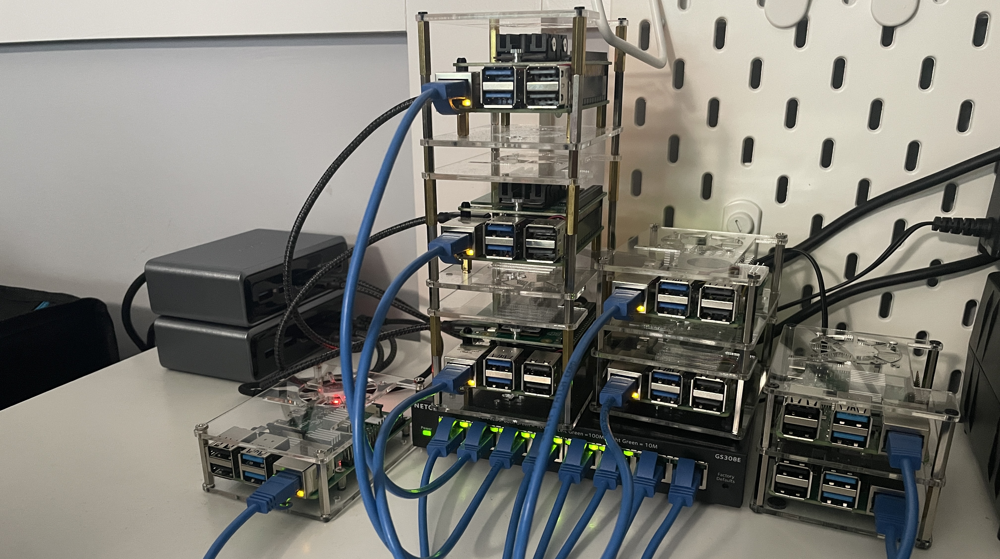

# Raspberry Pi Cluster Documentation

Welcome to the documentation for my Raspberry Pi cluster project — a home-lab setup built from scratch for educational purposes. My goal was to learn the basics of Kubernetes, automate deployments, and apply Infrastructure as Code (IaC) practices using real hardware.

This guide documents the entire process from start to finish, covering everything from initial hardware design to Kubernetes (K3s) deployment and daily operation.

## 📚 References & Inspirations
Throughout this project, I referenced a variety of documentation and videos to guide my build and deepen my understanding, and they are listed below:

- [Raspberry Pi Cluster by Ricardo Sanchez](https://picluster.ricsanfre.com/)
- [Raspberry Pi Cluster Build by Jeff Geerling](https://youtube.com/playlist?list=PL2_OBreMn7Frk57NLmLheAaSSpJLLL90G&si=eZ7kkoIi12Pm8vH0)
---

## 🚀 Quick Overview

- 🔢 **Total Nodes**: 5 (5x Raspberry Pi 5)
- 🧠 **Control Plane**: 3x Pi 5 with NVMe SSDs
- ⚙️ **Worker Nodes**: 2x Pi 5 with SD cards
- 🔗 **Networking**: All nodes wired via switch, static IPs
- 💾 **Storage**: NVMe SSDs on master nodes, SD on others
- 📦 **Orchestration**: K3s (Lightweight Kubernetes)
- 📡 **Load Balancer**: Pi 4 running HAProxy

---

## 🧭 Site Navigation

Here’s what you’ll find in this documentation:

- **[Getting Started](getting-started/motivation.md)**  
  Learn the motivation behind this project, hardware used, and architectural choices.

- **[Setup Guide](setup-guide/physical/rack.md)**  
  Step-by-step instructions for assembling, powering, and configuring your cluster.

- **[Cluster Deployment](cluster/k3s.md)**  
  Details on deploying K3s, configuring the control plane, and connecting worker nodes.

- **[Operating the Cluster](operating/apps.md)**  
  How to install apps, monitor resources, back up data, and more.
---

## 🧠 Why Build a Pi Cluster?

I work with HPC and distributed systems in my day job, and I wanted to bring that experience home with a compact, low-cost cluster. It's also just really cool to say:  
> "I built my own cluster from scratch."

Using cloud resources like AWS is great for short-term Kubernetes experiments and can be cost-effective for brief testing. However, for longer-term projects, the expenses add up quickly. With Raspberry Pis, I can experiment freely with orchestration, storage, and automation right from my desk—and if I ever want to repurpose the hardware, I can easily disassemble the cluster and use the Pis for other projects.

---

## 📎 Project Repository

You can find the source code, YAMLs, and helpful scripts here:  
👉 [GitHub Repository](https://github.com/JaeungJayJang/pi-cluster-setup)

---

Happy hacking! 🛠️
