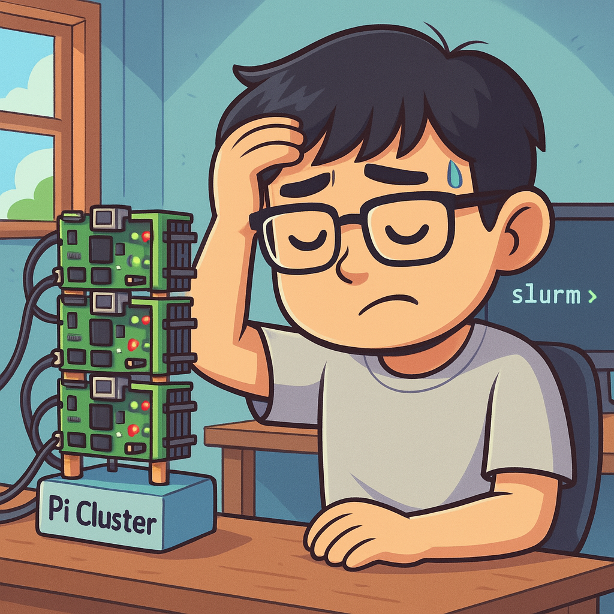
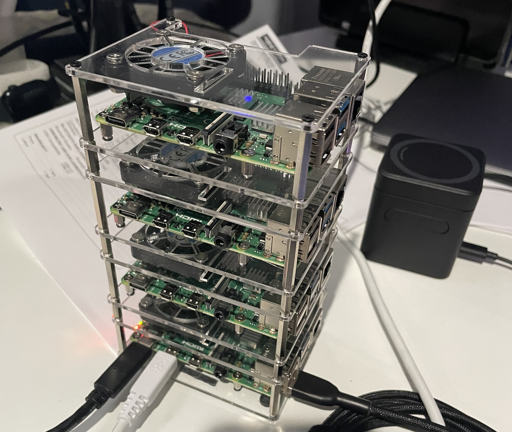
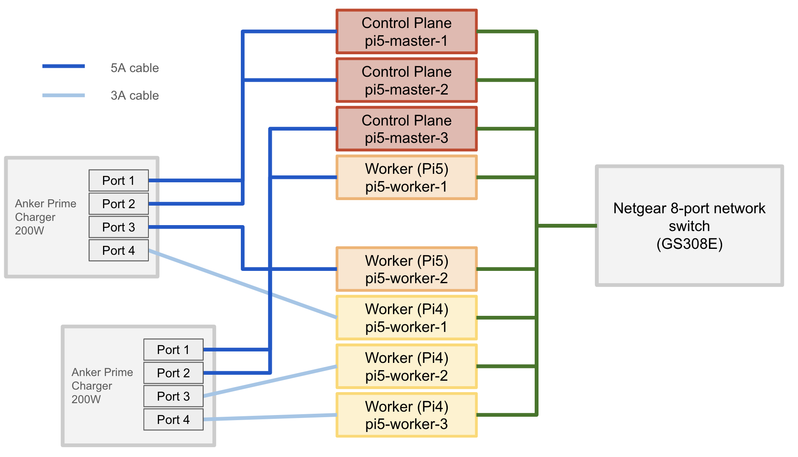

# Planning & Design

## Project Goals

### Primary Objectives
- [x] Learn the fundamentals of clustering and distributed systems (Slurm, Kubernetes)
- [x] Experiment with both HPC and container orchestration approaches
- [x] Build, break, and rebuild a real hardware cluster from scratch
- [x] Develop practical DevOps and infrastructure automation skills
- [x] Create a flexible home lab for ongoing experimentation
- [x] Understand hardware limitations and capacity planning through hands-on experience

### Secondary Goals
- [x] Compare and contrast different orchestration tools (Slurm vs. K3s)
- [x] Optimize for cost, power, and scalability
- [x] Document the full journey—including failures, pivots, and lessons learned
- [x] Achieve a production-like, high-availability Kubernetes cluster
- [x] Reduce reliance on cloud costs by self-hosting applications
- [x] Enable future expansion and hybrid workloads (Pi 4 + Pi 5)

## Project Evolution

### My Cluster Journey: From Slurm to Kubernetes

#### Phase 1: The Slurm Experiment
I started my cluster journey with the idea of building a low-cost HPC cluster using Slurm and several Raspberry Pi 4 boards (originally 1GB RAM models). My experience with AWS T2.micro instances made me think this would be enough for basic clustering. While I was able to get the Pis working together, I quickly realized that Slurm wasn’t a good fit for my needs—I didn’t require CPU-intensive batch jobs or heavy computation. The project was a great way to showcase my skills and past experience, but it wasn’t practical for my day-to-day goals.

#### Phase 2: Rethinking the Use Case
Wanting to focus more on application development and the full DevOps lifecycle, I began exploring container orchestration. I discovered K3s, a lightweight Kubernetes distribution that’s perfect for small clusters and edge devices. This shift allowed me to simulate scaling, deploy real applications, and even reduce my reliance on paid cloud services like AWS (which was costing me $10/month for just a couple of T2.micro instances and static IPs).

#### Phase 3: The K3s Reality Check
Inspired by [Jeff Geerling’s K3s tutorials](https://www.youtube.com/watch?v=N4bfNefjBSw&list=PL2_OBreMn7Frk57NLmLheAaSSpJLLL90G&index=3), I tried installing K3s on my Pi 4 cluster. Unfortunately, 1GB RAM was nowhere near enough for a Kubernetes control plane. The master node couldn’t even start reliably, and I learned the hard way how important it is to plan hardware specs before buying.

#### Phase 4: Hardware Upgrade & Cluster Expansion
Realizing the hardware bottleneck, I decided to upgrade. I started by purchasing two Raspberry Pi 5 boards (8GB RAM each) to test K3s performance. Encouraged by the results, I added two more Pi 5s, building a cluster with one master and three workers, all fitting nicely in a tower case.

#### Phase 5: Finalizing the Production Cluster
There was a long period of inactivity on the rpi5 clusters due to my personal life that I decided to disassemble everything and even repurposed one pi 4 for OctoPi (3d printer server) and added another pi 5. I was still feeling toward using slurm for some unforseen events in the future but I decided that would not come and would probably better to go with some other solutions like running directly on my mac, desktop, or even cloud. As my focus shifted fully to Kubernetes and my focus is back to building pi cluster again, I start gathering what I have. This brought my cluster to its current state: 5× Pi 5 (8GB RAM) and 3× Pi 4 (1GB RAM), all freshly re-imaged and ready for a robust, production-like Kubernetes environment.

### Current Configuration
- **Total Nodes**: 8 (5×Pi5 + 3×Pi4)
- **Architecture**: High-availability control plane with mixed worker nodes
- **Use Cases**:
  - Hands-on learning with Kubernetes, DevOps, and distributed systems
  - In-house hosting of personal and side-project applications (self-hosted services, web apps, automation, etc.)
- **Status**: In development right now

## Hardware Inventory

### Cluster Node Inventory

| Node | Role               | SD Card         | Pi Model     | Rationale                                                      |
|------|--------------------|-----------------|--------------|----------------------------------------------------------------|
| 1    | Control Plane #1   | 256GB V30 A2    | Pi 5 (8GB)   | Most reliable + performant node (etcd leader, kube-api)        |
| 2    | Control Plane #2   | 128GB V30 A1    | Pi 5 (8GB)   | Fast card and plenty of RAM for control tasks                  |
| 3    | Control Plane #3   | 64GB XC1        | Pi 5 (8GB)   | Still high RAM, and 64GB is enough with SSDs for etcd follower |
| 4    | Worker Node #1     | 64GB XC1        | Pi 5 (8GB)   | Strong worker node                                             |
| 5    | Worker Node #2     | 64GB XC1        | Pi 5 (8GB)   | Another high-capacity worker                                   |
| 6    | Worker Node #3     | 64GB XC1        | Pi 4 (1GB)   | Lighter worker load                                            |
| 7    | Worker Node #4     | 64GB XC1        | Pi 4 (1GB)   | Same as above                                                  |
| 8    | Utility / Monitor  | 32GB HC1        | Pi 4 (1GB)   | Least powerful node, for backup scripts, NFS, or logging agent |

### SD Cards Used
- 1× 256GB: V30 A2 XC1
- 1× 128GB: V30 A1 XC1
- 5× 64GB: XC1
- 1× 32GB: HC1

### Note on SD Card Usage
> The SD cards are primarily used for installing the OS and light storage tasks. For most nodes, I plan to migrate to NVMe SSDs for main storage in the future, which will improve reliability and performance.

### Peripherals

| Item | Description | Notes |
|------|-------------|-------|
| **240W USB-C Cable (1FT, Sumpk)** | Short, high-current USB-C to USB-C cable | Supports up to 5A, required for Pi 5. Will upgrade both cable and charger later if needed. |
| **Rapink Cat6a Patch Cables (1ft, 10-pack)** | Slim Cat6a Ethernet cables, 10G support | Cluster limited by switch to 1G, but future-proofs for 10G upgrades. |
| **NETGEAR GS308E Switch** | 8-Port Gigabit Ethernet, Smart Managed | Main network backbone for the cluster. |
| **ULIFTUS USB-C Cable (1ft)** | Short USB-C to USB-C cable | Used for additional power or data connections. |
| **Anker Prime Charger (200W, 6-port GaN)** | 4× USB-C + 2× USB-A charging station | Delivers up to 65W on leftmost ports; main power source for Pi 5 nodes. |

## Architecture Overview

The cluster is designed for high availability, flexibility, and hands-on experimentation with Kubernetes and distributed systems. It consists of a mix of Raspberry Pi 5 and Pi 4 nodes, connected via a gigabit Ethernet switch, and is powered by a robust multi-port USB-C charging station. The architecture supports both control plane and worker node roles, enabling a production-like environment for learning and self-hosting.

### Cluster Topology

*Figure: Logical layout of the Raspberry Pi cluster, showing control plane and worker nodes connected via a gigabit switch.*

- **Network Backbone:** All nodes are connected to a single gigabit Ethernet switch, ensuring low-latency communication and reliable networking for Kubernetes operations.
- **Power Delivery:** The main cluster is powered by a high-capacity USB-C GaN charger, with careful port assignment to maximize power delivery to the most demanding nodes (Pi 5s).

### Node Roles & Responsibilities

| Node Type | Quantity | Hardware | Role in Cluster | Description |
|-----------|----------|----------|-----------------|-------------|
| Control Plane | 3 | Pi 5 (8GB) | Kubernetes API, etcd, scheduler | Provides high-availability for the Kubernetes control plane. If one node fails, the cluster remains operational. |
| Worker Node (High Perf) | 2 | Pi 5 (8GB) | Application workloads | Runs most demanding pods and services, supports NVMe upgrades. |
| Worker Node (General) | 2 | Pi 4 (1GB) | Batch jobs, lighter workloads | Handles less resource-intensive tasks. |
| Utility/Monitor | 1 | Pi 4 (1GB) | Monitoring, backup, NFS | Dedicated to cluster support tasks and infrastructure monitoring. |

- **Control Plane Nodes:** Three Pi 5s form a highly available control plane, running the Kubernetes API server, etcd database, and scheduler. This setup ensures that the cluster can tolerate node failures without losing management capabilities.
- **Worker Nodes:** Two Pi 5s handle high-performance workloads, while three Pi 4s (1GB RAM) are assigned to general or batch processing tasks. This mix allows for flexible resource allocation and experimentation.
- **Utility Node:** A single Pi 4 (1GB RAM) is reserved for monitoring, backup scripts, or as a lightweight NFS server, keeping critical support services isolated from main workloads.

### High-Availability Design
- The control plane uses three nodes to achieve quorum for etcd and Kubernetes management, minimizing downtime during maintenance or hardware issues.
- Worker nodes can be added or re-imaged as needed, supporting future expansion or hybrid workloads.

### Storage & Future Upgrades
- All nodes currently boot from SD cards, but the architecture is designed to support NVMe SSD upgrades for improved performance and reliability, especially on Pi 5 nodes.

